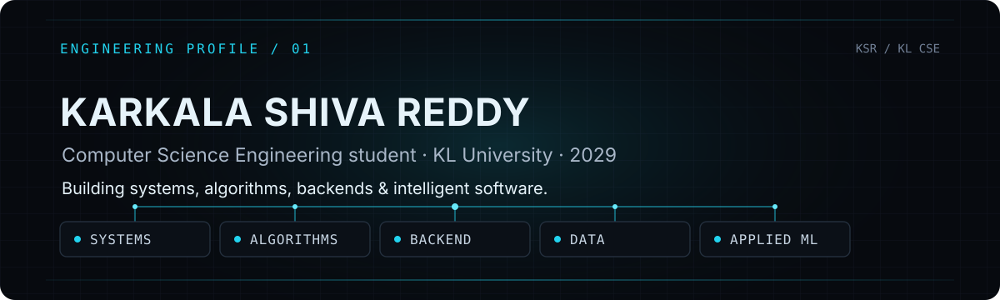
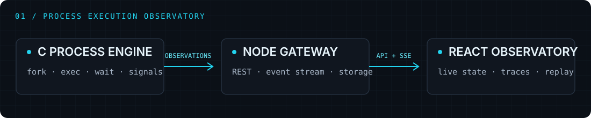
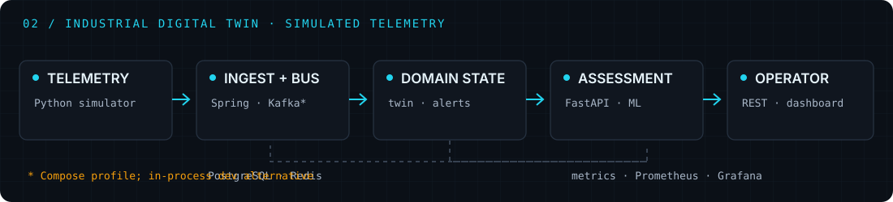
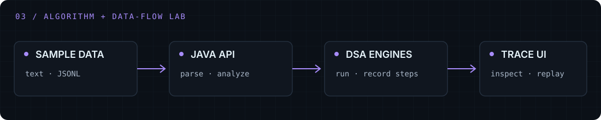
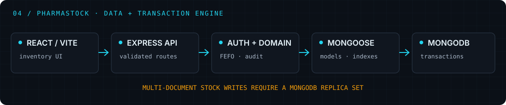
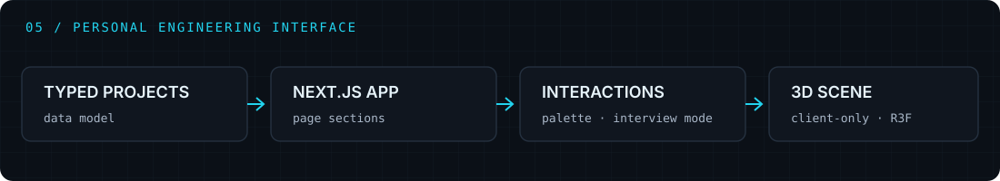

  

  <a href="#identity">IDENTITY</a> &nbsp;·&nbsp;
  <a href="#systems">SYSTEMS</a> &nbsp;·&nbsp;
  <a href="#algorithms">ALGORITHMS</a> &nbsp;·&nbsp;
  <a href="#stack">STACK</a> &nbsp;·&nbsp;
  <a href="#direction">DIRECTION</a> &nbsp;·&nbsp;
  <a href="#connect">CONNECT</a>

  <a href="https://github.com/karkalashivareddy">GITHUB</a> &nbsp;·&nbsp;
  <a href="https://www.linkedin.com/in/shiva-reddy-karkala-1a66b4397/">LINKEDIN</a> &nbsp;·&nbsp;
  <a href="https://codolio.com/profile/2520030105">CODOLIO</a> &nbsp;·&nbsp;
  <a href="https://portfolio-shiva-c677.vercel.app">PORTFOLIO URL · UNVERIFIED</a> &nbsp;·&nbsp;
  <a href="mailto:karkalashivareddy@gmail.com">EMAIL</a>

---

## Engineering identity

I’m **Karkala Shiva Reddy** — Shiva — a **B.Tech Computer Science Engineering student** at **KL University**, graduating in 2029. I build systems and backend software, algorithmic tools, and data-driven applications, with attention to correctness, observability, and clear architecture.

My strongest project work is in **systems observability and algorithm-driven software**: a C/Linux process-execution observatory, an industrial operations platform, and an interactive lab for inspecting algorithms on log data.

### How I build

`01 / UNDERSTAND` the behavior and constraints  →  `02 / IMPLEMENT` the smallest complete path  →  `03 / OBSERVE` what the system actually does  →  `04 / VERIFY` normal and failure paths  →  `05 / DOCUMENT` scope and limitations

---

## Flagship systems

### 01 · Systems / process observability

**[Command Argument Passing System — Process Execution Observatory](https://github.com/karkalashivareddy/Command-Argument-Passing-System)** executes allowlisted commands through a C11/POSIX engine; a Fastify gateway and React observatory expose real child-process events, `/proc` measurements, signal controls, and replay. PID identity is guarded by kernel start time. Sampling is scoped to one tracked child; descendants are not represented.

`C11/POSIX` · `Linux /proc` · `PID identity` · `signals` · `Fastify` · `SQLite` · `REST/SSE` · `React/Vite`

**Evidence:** executable engine and web application, documented guardrails and lifecycle, test harnesses, and repository CI. [SOURCE](https://github.com/karkalashivareddy/Command-Argument-Passing-System) · [ARCHITECTURE](https://github.com/karkalashivareddy/Command-Argument-Passing-System/tree/main/docs)

### 02 · Industrial digital twin

**[ForgeSense Industrial Intelligence](https://github.com/karkalashivareddy/forgesense-industrial-intelligence)** turns **simulated** machine telemetry into fleet state, anomaly and failure-risk assessments, maintenance workflows, alerts, and operator views. The repository includes a Spring Boot service, a FastAPI/scikit-learn service, a telemetry simulator, and Compose wiring for Kafka, PostgreSQL, Redis, Prometheus, and Grafana.

`Java/Spring Boot` · `Python/FastAPI` · `scikit-learn` · `Kafka` · `PostgreSQL` · `Redis` · `Docker Compose`

**Evidence:** backend and ML tests, CI checks, health/metrics endpoints, architecture notes, and explicit synthetic-data and model limitations. This is a reproducible engineering project, not a production deployment. [SOURCE](https://github.com/karkalashivareddy/forgesense-industrial-intelligence) · [ARCHITECTURE](https://github.com/karkalashivareddy/forgesense-industrial-intelligence/tree/main/docs)

### 03 · Algorithm / data-flow lab

**[LogInsight Analyzer](https://github.com/karkalashivareddy/KLH_CSE_2026-27_DSA-3_S3_T17_Loginsight-Analyzer)** makes algorithm behavior inspectable through log-analysis endpoints, selected step traces, and a React dashboard. Its Java engines cover string search, dynamic programming, graph and flow methods, approximation, randomized methods, and parallel operations.

`Java` · `Spring Boot` · `React` · `TypeScript` · `Vite` · `JUnit`

**Evidence:** Maven verification and frontend build workflows, bundled sample data, trace catalog, API documentation, and stated in-memory/coursework scope. No fixed test count or coverage figure is claimed. [SOURCE](https://github.com/karkalashivareddy/KLH_CSE_2026-27_DSA-3_S3_T17_Loginsight-Analyzer) · [ARCHITECTURE](https://github.com/karkalashivareddy/KLH_CSE_2026-27_DSA-3_S3_T17_Loginsight-Analyzer/tree/main/docs)

---

### Product and data engineering

#### 04 · Data / transaction engine

**[PharmaStock / Database Systems](https://github.com/karkalashivareddy/DataBase-System-and-Distributed-Backend-Development)** is a batch-aware medicine inventory application. Its Express/Mongoose API models stock movements as transactions, allocates sales by FEFO, enforces role checks at the API, and records audit events; the React/Vite client provides inventory and reporting workflows. Stock writes require a MongoDB replica set.

`React/Vite` · `Node.js/Express` · `MongoDB/Mongoose` · `JWT/RBAC` · `transactions` · `FEFO`

**Evidence:** unit and API tests, transaction integration tests, database verification, browser E2E workflow, and a GitHub Actions pipeline. The repository documents demo-only authentication storage and other deployment limits.

[SOURCE](https://github.com/karkalashivareddy/DataBase-System-and-Distributed-Backend-Development) · [PROJECT README](https://github.com/karkalashivareddy/DataBase-System-and-Distributed-Backend-Development/tree/main/Project)

#### 05 · Personal engineering interface

**[Engineering portfolio](https://github.com/karkalashivareddy/portfolio)** is a Next.js/TypeScript application with typed project data, a client-only Three.js scene, navigation and command-palette interactions, and reduced-motion/mobile behavior. Its source README says the supplied Vercel URL is no longer serving the app; the repository is the reliable project path.

[SOURCE](https://github.com/karkalashivareddy/portfolio) · [SUPPLIED PORTFOLIO URL — UNVERIFIED](https://portfolio-shiva-c677.vercel.app)

### Academic and practice work

[OSSP systems programming](https://github.com/karkalashivareddy/Creaters_Shell_OSSP) · [DSA2 projects](https://github.com/karkalashivareddy/DSA2-Projects) · [Hospital Bed Dashboard](https://github.com/karkalashivareddy/hospital-bed-dashboard) · [Timetable Generator](https://github.com/karkalashivareddy/university-time-table-generator) · [FWD coursework](https://github.com/karkalashivareddy/FWD)

These are coursework and practice repositories. The project READMEs describe what is implemented and where the limits are.

---

## Algorithm practice

I use **Java** for data-structure and algorithm work: decomposing problems, reasoning about complexity, choosing structures, and checking edge cases. LogInsight connects that practice to a larger application: implementations run against input data, and selected engines expose execution traces for inspection.

[Codolio](https://codolio.com/profile/2520030105) · [LeetCode](https://leetcode.com/u/KarkalaShivaReddy/) · [CodeChef](https://www.codechef.com/users/shivareddy_27) · [Codeforces](https://codeforces.com/profile/shiva_reddy_27) · [GeeksforGeeks](https://www.geeksforgeeks.org/user/shiva0327/) · [HackerRank](https://www.hackerrank.com/profile/karkalashivareddy)

No platform ratings or problem counts are shown here because I have not verified current figures for this README.

---

## Engineering stack

Technologies below are drawn from the selected repositories and supporting project work; this list describes use in projects, not expertise level.

| Layer | Verified project use |
| --- | --- |
| **Languages** | Java · C · Python · JavaScript · TypeScript · SQL |
| **Application** | React · Next.js · Vite · Three.js |
| **Backend** | Spring Boot · FastAPI · Node.js · Express · REST · Server-Sent Events · WebSockets |
| **Data and messaging** | MongoDB · PostgreSQL · MySQL · SQLite · Redis · Kafka |
| **Systems** | Linux/POSIX · processes · signals · `fork`/`exec` · IPC · `/proc` |
| **ML** | scikit-learn · feature engineering · anomaly and failure-risk assessment |
| **Engineering** | GitHub Actions · Docker Compose · Maven · npm · JUnit · pytest · Node test runner · browser E2E · Prometheus · Grafana |

---

## Current engineering vector

→ Deepening Java backend design, testing, database work, and observability.

→ Strengthening systems programming and real-time service foundations.

→ Exploring distributed systems and applied ML within software applications.

The direction is to make services easier to reason about: clear boundaries, observable behavior, useful tests, and honest operational limits.

---

## Connect

**Let’s build software that stays understandable when the system gets complicated.**

[GitHub](https://github.com/karkalashivareddy) · [LinkedIn](https://www.linkedin.com/in/shiva-reddy-karkala-1a66b4397/) · [Codolio](https://codolio.com/profile/2520030105) · [Portfolio URL · unverified](https://portfolio-shiva-c677.vercel.app) · [Email](mailto:karkalashivareddy@gmail.com)

  

<a href="#top">Back to top ↑</a>

